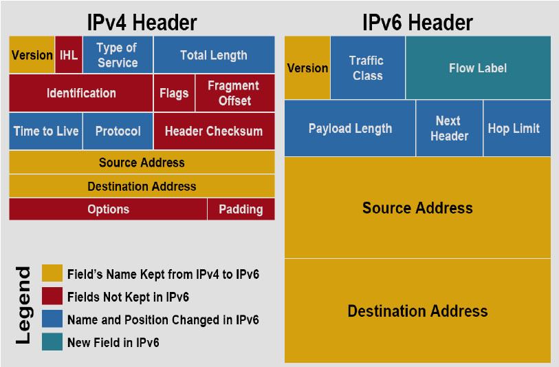

# 200-301 CCNA

Notes for the [200-301 CCNA Training from YouTube](https://www.youtube.com/playlist?list=PLh94XVT4dq02frQRRZBHzvj2hwuhzSByN):

1. [Network Fundamentals](#network-fundamentals)
2. [IP Address](#ip-address)
3. [Networking Devices and Protocols](#networking-devices-and-protocols)
4. [Cisco IOS](#cisco-ios)
5. [Switches](#switches)
6. [VLANs](#vlans)
7. [VTP](#vtp)
8. [Switchport Security](#switchport-security)
9. [Routers](#routers-and-routing)
10. [RIP Routing](#rip-routing)
11. [Routing Advanced](#routing-advanced)
12. [IPv6](#ipv6)
13. [ACL](#acl)

## Network Fundamentals

* Network - multiple computers linked to share resources and communicate; common types include LAN (Local Area Network) and WAN (Wide Area Network).

* OSI Model and TCP-IP Model:

  

* Layers of the OSI (Open Systems Interconnection) model:

  * Application layer - PoC for all network-aware apps
  * Presentation layer - converts data from session layer and sends it to application layer; offers encryption services
  * Session layer - creates and maintains sessions
  * Transport layer - uses segments as data unit, and adds header to segments for encapsulation; can use reliable (TCP) or unreliable (UDP) communication - also adds source port numbers
  * Network layer - uses packets as data unit; responsible for IP addressing and finding best path
  * Data link layer - uses frames as data unit; responsible for MAC addressing and error checking
  * Physical layer - uses bits as data unit; actual data transfer and hardware connections

* Simplified working of OSI model:

```markdown
Suppose we send an email to someone; this email would first pass through application layer towards presentation layer - this will compress the data.

The session layer is responsible for communication and encryption. Then, the data is divided into segments in transport layer - this layer also adds a transport header to the data.

Now, the segments are sent to the network layer, which adds a header of its own to the segments, thus creating packets.

These packets are forwarded to data link layer, which adds a data link header to it, where it would be called a frame now.

Finally, this frame is converted into bits (0s and 1s) in the physical layer.

Once the physical layer sends these bits to the recipient physical layer, the receiving layers strip the headers of the corresponding layers until it gets all the segments, which is then taken care of by the upper layers.
```

## IP Address

* An IP address consists of 4 octets, with numbers in each octet ranging from 0-255; the address is of 32 bits in binary format.

* IP address has two parts - network (all 1s) and host (all 0s); this can be determined using the subnet mask.

* If an IP address needs to communicate with another IP address, it has to go through the gateway.

* IP address classes identified by first octet:

  * Class A - 1-126
  * Class B - 128-191
  * Class C - 192-223
  * Class D - 224-239
  * Class E - 240-255

* Example:

```markdown
IP address - 192.168.100.225 (/24)

Subnet mask - 255.255.255.0

Gateway - 192.168.100.1

Network Id (first) - 192.168.100.0

Broadcast Id (last) - 192.168.100.255

Number of valid hosts - 254
```

* Number of valid IP addresses in network is ```2^(number of host bits) - 2```

* Private IP addresses - IP addresses which can communicate only on local network:

  * Class A - 10.0.0.0 - 10.255.255.255
  * Class B - 172.16.0.0 - 172.31.255.255
  * Class C - 192.168.0.0 - 192.168.255.255

* Subnetting - dividing network into smaller subnets; uses CIDR (Classless Inter Domain Routing) notation. We can divide a network only in even numbers of subnets.

* Subnetting examples:

```markdown
IP address - 192.168.100.225
Subnet mask - 255.255.255.0

Suppose we need to divide this network into 2 subnets.
We can denote subnet mask in binary format - 11111111.11111111.11111111.00000000

To divide in 2 subnets, extend network bits by 1, such that we have total of 25 network bits now.
New subnet mask - 11111111.11111111.11111111.10000000 (or 255.255.255.128)

Using this format, we have -

  Network Id 1 - 192.168.100.0/25
  Network Id 2 - 192.168.100.128/25

  Broadcast Id 1 - 192.168.100.127/25
  Broadcast Id 2 - 192.168.100.255/25
```

```markdown
IP address - 192.168.100.225
Subnet mask - 255.255.255.192 - 11111111.11111111.11111111.11000000

We have 24+2=26 network bits here; so the number of possible subnets is 2^2=4

Network Id 1 - 192.168.100.0/26
Network Id 2 - 192.168.100.64/26
Network Id 3 - 192.168.100.128/26
Network Id 4 - 192.168.100.192/26

Broadcast Id 1 - 192.168.100.63/26
Broadcast Id 2 - 192.168.100.127/26
Broadcast Id 3 - 192.168.100.191/26
Broadcast Id 4 - 192.168.100.255/26
```

```markdown
Given IP - 192.168.225.212/27

Here, /27 means we have 27 (24+3) network bits, so number of possible subnets would be 8 (2^3); each subnet would have 30 (256/8 - 2) hosts.

Therefore, Network Id is 192.168.225.192/27 and Broadcast Id is 192.168.225.223/27
```

```markdown
IP - 165.245.12.88/20

Here, /20 means we have 20 (16+4) network bits, so the 4 network bits in binary representation would be 11110000, which is 240 in binary.

So subnet mask - 255.255.240.0

Also, as we have 4 network bits in third octet, we will have 2^4=16 subnets.

So, network Id for the subnets would be 165.245.0.0, 165.245.16.0, 165.245.32.0, and so on (since 256/16=16)

For corresponding IP, network Id - 165.245.0.0 and broadcast Id - 165.245.15.255
```

```markdown
IP - 18.172.200.77/11

/11 means we have 11 (8+3) network bits; converting the 3 network bits from binary to decimal gives us 224.

So, subnet mask - 255.224.0.0

As we have 3 network bits in second octet, we have 2^3=8 subnets.

So, network Id for subnets would be 18.0.0.0, 18.32.0.0, 18.64.0.0 and so on.

Therefore, for given IP, network Id - 18.160.0.0 and broadcast Id - 18.191.255.255
```

```markdown
We need to design a network with 3 subnets with requirements of 60, 100 and 34 computers for each subnet (VLSM).

For the requirement of 100 computers, we can use the subnet with 126 hosts such that Network Id - 192.168.1.0/25, and Broadcast Id - 192.168.1.127/25

For the next requirement of 60 computers, we can use a subnet with 62 hosts, that is, with Network Id - 192.168.1.128/26 and Broadcast Id - 192.168.1.191/26

Similarly, for the final 34 computers, we can use the Network Id 192.168.1.192/26 and Broadcast Id 192.168.1.255/26
```

```markdown
IP address - 172.16.100.225
Subnet mask - 255.255.0.0

For dividing this network into 2 subnets, we can use the approach of extending network bits by 1, ending up with 17 network bits.

Network Id 1 - 172.16.0.0/17
Network Id 2 - 172.16.128.0/17

Broadcast Id 1 - 172.16.127.255/17
Broadcast Id 2 - 172.16.255.255/17
```

```markdown
IP address - 10.20.100.225
Subnet mask - 255.0.0.0

Dividing this network into 2 subnets, extend network bits by 1, so we have 9 network bits now.

Network Id 1 - 10.0.0.0/9
Network Id 2 - 10.128.0.0/9

Broadcast Id 1 - 10.127.255.255/9
Broadcast Id 2 - 10.255.255.255/9
```

```markdown
We have to find network and broadcast Id of 172.10.21.21/24

As this is a class B address, subnet mask is 255.255.0.0

So, the network Id would start from 172.10.0.0 for the subnets.
According to given IP, the corresponding network Id would be 172.10.21.0 and Broadcast Id 172.10.21.255
```

## Networking Devices and Protocols

* Hub:

  * Non-intelligent
  * 1 collision domain
  * 1 broadcast domain
  * Layer 1 device
  * On basis of broadcasting

* Switch:

  * Intelligent device (uses ASIC, can store MAC address info)
  * Many collision domains (as many as number of ports)
  * 1 broadcast domain and 1 IP network
  * Layer 2 device
  * On basis of MAC address

* Router:

  * Intelligent device (can act as gateway)
  * Many collision domains
  * Many broadcast domains
  * Layer 3 device
  * On basis of IP address

* DHCP (Dynamic Host Configuration Protocol) - to configure IP addresses to hosts dynamically; DHCP has mainly 6 types of messages (4 are mandatory):

  * DHCP Discover
  * DHCP Offer
  * DHCP Request
  * DHCP Ack
  * DHCP Information (optional)
  * DHCP Release (optional)

* TCP (Transmission Control Protocol):

  * Features:

    * Reliable
    * Connection-oriented
    * Error-checking and recovery mechanism
    * Flow control and QoS (Quality of Service)
    * Full-duplex
    * Point-to-point
    * Windowing (flow control mechanism to determine buffer for receiver)

  * Working:

    * Connection is established using 3-way handshake
    * SYN segment (client to server) -> SYN+ACK segment (server to client) -> ACK segment (client to server)

* UDP (User Datagram Protocol):

  * Features:

    * Unreliable
    * Connection-less
    * Faster transmission
    * Independently-handled segments
    * Stateless (no ACK)
    * Process-to-process

  * Working:

    * UDP takes a datagram from Network Layer, attaches its header, and sends it to user
    * Used mainly in streaming services, real-time apps

* ARP (Address Resolution Protocol):

  * Used to find MAC address of device corresponding to its IP address.
  * To establish connection between two devices, source device needs to generate ARP request.
  * ARP request is broadcast, but ARP reply is unicast.

## Cisco IOS

* Cisco IOS (Internetwork Operating System) - proprietary OS for Cisco switches & routers.

* Configuration modes:

  * User EXEC mode - denoted by prompt ```>```; type ```enable``` (or ```en``` or ```ena```) to escalate to higher mode.

  * Privileged EXEC mode - denoted by prompt ```#```; type ```configure terminal``` (or ```conf t```) to escalate to highest mode.

  * Global configuration mode - denoted by prompt ```(config)#```; this mode can be used for configuration in interfaces, routers and lines as well.

* In Cisco IOS, ```?``` is used in command line for help.

* Switch config commands:

```shell
en

conf t
#enter global config mode

hostname newName
#change hostname

banner motd
#modify banner MOTD

line con 0
password p@55wd
login
#enforce console password

no ip domain-lookup
#disable domain lookup

line vty 0 15
password t3ln3t
login
#enforce telnet password

enable password en4bl3
#enforce password for 'en' command

exit
#back to privileged exec mode

sh ip int br
#show ip interface brief - shows all interfaces

conf t
#switch to global config mode

int vlan 1
ip add 10.1.1.1 255.255.255.0
#add management IP

shutdown
#configure interface to shutdown

no shutdown
#change interface to UP status

ip default-gateway 10.1.1.10
#add default gateway (in case of multiple networks)

exit
#back to privileged exec mode

write
#save running config (temporary) to startup config (permanent)

copy running-config startup-config
#newer way to save config
```

* Enabling SSH:

```shell
en
conf t
#global config mode

ip domain-name sv.org
#add domain-name

crypto key generate rsa
#generate secure key

ip ssh version 2
#use SSH version 2

username testuser password pa55123
#create user-password

line vty 0 15
transport input ssh
#allow SSH only
```

## Switches

* Switch functions:

  * Address learning - switches learn source MAC addresses and store it in the CAM (Content Addressable Memory) table or MAC address table.

  * Forwarding decision - switches decide whether to forward or filter a frame based on destination MAC address.

  * Loop avoidance - switches use STP (Spanning Tree Protocol) to prevent layer 2 loops like MAC address flapping.

* Switchport modes:

  * Access mode - used when connecting to end device; enabled by command ```switchport mode access```

  * Trunk mode - used when connecting to another switch; enabled by command ```switchport mode trunk```

* Types of trunking protocols:

  * ISL (Inter-Switch Link) - old protocol; Cisco-proprietary
  * IEEE 802.1Q (dot1q) - industry standard; non-proprietary

* DTP (Dynamic Trunking Protocol) - Cisco-proprietary protocol for switches; its modes are:

  * Desirable - switchport starts sending DTP packets to negotiate; ```switchport mode dynamic desirable```
  * Auto - flexible state, waits for DTP negotiation; ```switchport mode dynamic auto```
  * No negotiate - disable DTP and trunking; ```switchport nonegotiate```

## VLANs

* VLANs (virtual LANs) are logically grouped devices, configured on switches in the same broadcast domain.

* Each VLAN is treated as its own subnet or broadcast domain, so the frames broadcasted onto the network will be switched only between ports in same VLAN.

* VLANs help in flexibility and security of network designs.

* When frames traverse a trunk port, a VLAN tag is added to distinguish which frames belong to which VLANs; access ports do not require a VLAN tag as all frames belong to a single VLAN.

* Native VLAN is a special VLAN whose traffic traverses a trunk port without a VLAN tag (untagged).

* VLAN config:

```shell
en
#in priv exec mode now

show vlan
#shows VLANs

conf t
#in global config mode now

vlan 10
#create VLAN 10 (can use any number from 1-1005)

name departmentName

#Ctrl+Z
#in priv exec mode

int f0/1
#interface config

switchport mode access

switchport access vlan 10
#access mode

#Ctrl+Z

int vlan1
#default VLAN

ip add 10.1.1.1 255.255.255.0
#assign management IPs

no sh

#Ctrl+Z

int f0/4

switchport mode trunk
#config trunk mode
#assign port to trunk

#Ctrl+Z

sh interfaces trunk
#shows trunk interfaces, native vlan

#Ctrl+Z

int range f0/2-3
#config for multiple ports

switchport mode access

switchport access vlan 20
#vlan 20 created for fa0/2 and fa0/3
```

* Native VLAN config:

```shell
en
conf t

#global config mode

int fa0/1

switchport trunk native vlan 10
#any traffic out of switch for vlan 10 goes untagged
#possible native vlan mismatch due to different configs
```

## VTP

* VTP (VLAN Trunking Protocol) - Cisco-proprietary protocol, used to sync VLAN info in same VTP domain; it is not a trunking protocol.

* Using VTP, when a new VLAN is created, it is replicated across all switches with the help of a synced VLAN DB (we only need to create access port).

* VTP uses Revision no. to compare & prioritize VLAN DB, so it needs to be used carefully; best practice is to not use VTP unless required.

* Requirements:

  * VTP version must be same on the switches to be configured.
  * VTP domain name must be same on switches
  * One of the switches must be a server
  * Authentication should match (if used)

* VTP modes:

  * Server - for making config changes
  * Client - receives changes from server
  * Transparent - not using VTP

* VTP config:

```shell
en

show vtp status
#shows vtp version, status, server by default

conf t
#in global config mode

vtp version <1/2>

vtp mode <server/client/transparent>

vtp domain domainName.org

vtp password pa55wd
```

* VTP Pruning - improves network performance & bandwidth by decreasing unnecessary flooded traffic; disabled by default in Cisco switches.

* VTP pruning sends broadcasts only to those trunk links that actually need the info.

* VLAN 1 (default VLAN) cannot be pruned as it's an administrative VLAN.

```shell
en
conf t
#enter global config mode

vtp pruning
#enables vtp pruning
#does not work in Cisco Packet Tracer

vtp status
#shows pruning enabled

#'vlan allowed' command can also be used alternatively
```

## Switchport Security

* Reasons for slow connection include speed, duplex (half/full) mismatch:

```shell
en
conf t

int f0/1
#config interface

speed 100
#100 Mbps

duplex full

#Ctrl+Z

sh interfaces f0/1
#shows speed, duplex config
```

* Port security (can only be enabled on access ports):

```shell
#in interface config mode

switchport port-security ?
#shows all options
#this is also a valid command to enable port-security

switchport port-security mac-address 0001.6307.EEAE
#only MAC address allowed on switchport

switchport port-security mac-address sticky
#for configuring addresses dynamically

switchport port-security maximum 2
#max addresses to be learnt by switchport

switchport port-security violation <protect/restrict/shutdown>
#marks as security violation

#Ctrl+Z to go to user exec mode

sh interfaces f0/1
#can check violations from here

sh port-security
#tabular view

sh port-security address
#shows secure MAC address table

sh port-security interface f0/1
#more details

#restart switch to make port-security work

int f0/1

shutdown
no shutdown
```

## Routers and Routing

* Routers - Layer 3 device, which can act as gateways; responsible for the routing process (path selection).

* Routers receive packets when the destination node is in a different network; this process of sending packets between two networks is aided by the routing table (repo of all routes to all destinations in network).

* Types of routing:

  * Static (or non-adaptive) routing - network admin uses static tables to manually config & select network routes; helpful where constant parameters are required, but this also leads to decreased adaptibility and flexibility of networks.

  * Dynamic (or adaptive) routing - routers create & update routing tables at runtime based on network conditions; they attempt to find fastest path using dynamic routing protocols (which maintain the routing table).

* Types of routing protocols:

  * Interior gateway protocols (IGP) - these protocols assess the Autonomous System and make routing decisions based on metrics like hop counts, delay and bandwidth. Types of IGP include:

    * RIP (Routing Information Protocol)
    * OSPF (Open Shortest Path First)
    * EIGRP (Enhanced Interior Gateway Routing Protocol) - Cisco-proprietary, efficient

  * Exterior gateway protocols (EGP) - these protocols manage multiple Autonomous Systems. Types of EGP include:

    * BGP (Border Gateway Protocol)
    * EGP (Exterior Gateway Protocol)

* Types of routing algorithms:

  * Distance vector routing - checks distance (hops); goes for shortest path (e.g. - RIP)
  * Link state routing - checks link state/speed; calculates cost of resources associated with each path (e.g. - OSPF)

* Cisco routers are enhanced by CEF (Cisco Express Forwarding); this minimises the load on the router's processor and makes routing more efficient.

* Router config:

```shell
en
conf t
#enter global config mode

hostname R1
#change hostname

do sh ip int br

int g0/0

no shutdown
#change interface to UP

line con 0

password c0ns0le
login
#console password

#Ctrl+Z to go to global config

service password-encryption
#encrypts password in running-config

line vty 0 4

password t3ln3t
#telnet password

#in global config mode

int g0/0

ip address 10.1.1.1 255.255.255.0
no sh
#assign ip address

banner motd &
#enter logon banner message

#in priv exec mode

copy running-config startup-config
#save config

sh ip interface br
show interfaces
#to verify changes in config

show ip route
#view routing table
```

* Static routing config:

```shell
#after initial router config

sh ip route
#view routing table
#static routing to add routes manually

#format - ip route <network id> <mask> <next hop/exit interface>

#in global config mode

ip route 192.168.4.0 255.255.255.0 192.168.2.2
#this router will send any traffic for 192.168.4.0 to 192.168.2.2

do sh ip route
#view updated routing table

#update other routers as well for both directions via static routing
```

## RIP Routing

* RIP (Routing Information Protocol) versions:

  * RIPv1:

    * Classful (does not support VLSM)
    * No authentication
    * Uses broadcast

  * RIPv2:

    * Classless (supports VLSM)
    * Adds authentication
    * Uses multicast

* RIP uses hop counts as a metric (measure used to decide which route is better; lower number is better); only 15 hops in a path are supported.

* RIP config:

```shell
#after initial router config
#in global config mode

router ?
#shows supported protocols

router rip
#use rip

version 2

network 10.0.0.0
#enter classful version

network 192.168.1.0
#enter other adjacent network id (classful)

no auto-summary
#turn off auto-summarization

#router starts advertising routes to other networks

#Ctrl+Z

sh ip route
#view routing table

#follow rip config for other routers as well

#troubleshooting commands

debug ip rip
#to debug all rip updates

undebug all
#turn off debug mode

sh ip protocols
#view routing protocols used
```

* RIP timers:

  * Update timer - 30 seconds - to send routing updates
  * Invalid timer - 180 seconds - since last valid update was received
  * Holddown timer - 180 seconds - waiting time before any new updates are accepted
  * Flush timer - 240 seconds - since last valid update was received, until route is flushed

* If the updates are not received, the invalid and flush timers begin simultaneously; after 180 seconds, the invalid timer ends and the holddown timer begins.

* RIP limitations:

  * Auto summarization, leads to inaccurate info
  * Slow convergence (shared info between routers)
  * Loops
  * Problem with distance vector, should consider link state metric as well

* Administrative distance (AD) - number assigned to routes (static, dynamic, directly-connected) which denotes trustworthiness of routing info received from neighbor router; the lower the AD value, the more preferred the route.

* Default AD values:

  * Directly connected - 0
  * Static route - 1
  * Internal EIGRP - 90
  * OSPF - 110
  * RIP - 120
  * External EIGRP - 170
  * Unknown - 255

* ```Counting to Infinity``` problem:

```markdown
This problem occurs due to routing loops in the network, which happens in two cases:

  * When 2 neighboring routers in network send an update simultaneously at the same time to the router

  * When an interface between two routers goes down in the network

This leads to a case of incorrect updates being sent by one router to its neighboring router, and it is about the number of hops required to reach the unreachable router (as the interface is down).

This incorrect update is continued by the other router, and it keeps on increasing the number of hops until infinity (15 is the highest number of hops in RIP, so 16 is infinity).
```

* RIP mechanisms to solve ```Counting to Infinity```:

  * Split Horizon - according to this, the router cannot send routing information back in the direction from which it was received; this can help in avoiding routing loops.

  * Route Poisoning - when an interface/link is down, this info is spread to all other routers in the network by indicating the cost of the distance between the routers with the broken interface is infinity; therefore, these routers are considered poisoned. However, this method can increase the size of routing announcements.

## Routing Advanced

* Example entry in routing table:

  ```R  192.168.30.0/24 [120/1] via 192.168.20.1, 00:00:01, FastEthernet0/1```

  ```markdown
  'R' denotes a RIP route for 192.168.30.0/24, connected to the IP via 192.168.20.1.

  [120/1] denotes 120 AD and 1 hop (metric) between IP and route.
  ```

* In routing table, '*' denotes candidate default entry or a default static route; this defines where packets will be sent if no specific route for the destination network is listed in the routing table.

* If no default route is set, the router discards all packets with destination addresses not found in its routing table.

* Types of static routes:

  * Default route
  * Network route
  * Host route
  * Summary route
  * Floating route

* Inter-VLAN routing - way to forward traffic between different VLANs by implementing a router in the network; can be achieved using:

  * Traditional inter-VLAN routing:

    * A router is usually connected to the switch using multiple interfaces (one for each VLAN).

    * Router interfaces are configured as default gateways for the VLANs; and switch ports connected to router are in access mode.

    * When user node sends message to user in different VLAN, the message moves to the access port that connects to the router on their VLAN. The router examines the packet's destination IP and forwards it to the correct network using access port; now the switch can forward the frame to destination node since router changed VLAN info from source to destination VLAN.

    * In this form, router needs to have as many LAN interfaces as the number of VLANs.

  * Router-on-a-stick:

    * In this, router is connected to the switch using a single interface; switchport connecting to router is configured as trunk link.

    * The single interface is configured with many IPs corresponding to VLANs on switch; this interface accepts traffic from all VLANs and determines destination network based on packet headers, and then forwards data to switch with correct VLAN info.

    * On router, the physical interface is divided into smaller interfaces called subinterfaces; when it receives the tagged traffic, it forwards the traffic out to the subinterface with the destination IP.

    * Configuration:

    ```shell
    #on switch, define interface connected to router as trunk link
    #in global config mode
    int f0/1

    switchport mode trunk

    #create subinterface in router
    #global config mode
    int f0/0.10
    #subinterface for VLAN10

    #in subinterface config mode
    #link VLAN id with subinterface
    encapsulation dot1q 10

    #assign ip (default gateway) and subnet mask for VLAN 10
    ip address 192.168.10.1 255.255.255.0

    #config remaining subinterfaces for respective VLANs

    int f0/0

    no sh
    #activates VLAN interfaces
    ```

## IPv6

* While IPv4 is a 32-bit address, IPv6 is a 128-bit address; NAT used to conserve the number of IPv4 addresses required.

* IPv6 also allows a single interface to have multiple addresses, unlike IPv4.

* IPv6 format:

  * Zeros groups can be abbreviated with double colon, only once per IP
  * Leading zeros can be omitted
  * For example, ```FE80:0000:0000:0000:5400:04FF:FEDD:53F8``` can be also written as ```FE80::5400:4FF:FEDD:53F8```

* APIPA (Automatic Private IP Addressing) - enables computers (DHCP clients) to auto-configure an IP address and subnet mask when DHCP server is unreachable; IP format is 169.254.x.x and subnet mask is 255.255.0.0

* IPv4 header vs IPv6 header:

  

* Types of IPv6 addresses:

  * Unicast - one-to-one
  * Multicast - one-to-many (range is FF00::/8)
  * Anycast - one-to-closest

* Types of unicast addresses:

  * Global address - similar to public IPv4 address; assigned range of 2001::/16, and initial 3 bits cannot be changed.

  * Link-local address - private IP (not routable), used for addressing a single link; range is FE80::/10, and it is auto-generated when IPv6 is enabled.

  * Unique local address - routable except on (public) Internet, similar to private IPv4 address; range is FC00::/7

* IPv6 configuration types:

  * Auto link local (EUI-64, identified using FFFE bit in address)
  * Manual link local
  * Auto IPv6 address
  * Manual IPv6 address

* IPv6 config:

```shell
#in router, global config mode

int g0/0

ipv6 address 2001::1/64
#slash notation accepted for ipv6

no sh

exit

sh ipv6 int br
#view ipv6 info
#we can add multiple ipv6 addresses for same interface

int g0/0

ipv6 address FE80::1 link-local
#add link-local address manually, this does not accept slash notation
#this replaces auto link-local address

#for auto ipv6 address in eui-64 form
ipv6 address 2010::/64 eui-64

no sh
```

## ACL

* ACL (Access Control List) - list of ```Permit```/```Deny``` statements for movement of data from network layer (layer 3) and above; applied in routers.

* Types of ACLs:

  * Standard ACL:

    * Identification no. from 1-99 or 1300-1999
    * Named version
    * Classify traffic based on source IP
  
  * Extended ACL:

    * Identication no. from 100-199 or 2000-2699
    * Named version
    * Classify traffic based on source IP, destination IP, protocol and port no.

* ACL config guidelines:

  * List of conditions
  * Possible actions - Permit, Deny
  * Packet compared to list from top to bottom
  * Once match is found, there are no more comparisons
  * Every ACL has implicit deny (Deny Any) at end, if ACL is non-empty
  * Standard ACL applied close to destination
  * Extended ACL applied close to source

* Standard ACL syntax:

  * Classic syntax:

  ```shell
  #in global config mode
  access-list <acl-no> <deny/permit> <matching params>

  int f0/0

  #apply ACL
  ip access-group <acl-no/name> <in/out>
  ```

  * Modern syntax:

  ```shell
  #in global config mode
  ip access-list standard <acl-no/name>

  <deny/permit> <matching params>

  #apply ACL in same way as before
  ```

* Wildcard masks:

  ```markdown
  Given IP - 192.168.100.225/24
  Subnet mask - 255.255.255.255.0
  So, wildcard mask - 0.0.0.255 (subtract subnet mask from 255.255.255.255)
  ```

  ```markdown
  Given IP - 192.168.100.225/26
  Subnet mask - 255.255.255.192
  Wildcard mask - 0.0.0.63
  ```

  ```markdown
  Identify hosts with even number in 4th octet
  Given IP - 192.168.100.0
  Subnet mask - 255.255.255.0
  Wildcard mask - 0.0.0.254 (last binary bit is 0 to allow only even numbers)
  ```

* Extended ACL syntax:

  * Classic syntax:

  ```shell
  #in global config mode
  access-list <acl-no> <deny/permit> <protocol> <source ip> <wildcard mask> <protocol info> <destination ip> <wildcard mask> <protocol info>

  #apply acl
  int f0/0

  ip access-group <acl-no/name> <in/out>
  ```

  * Modern syntax:

  ```shell
  ip access-list extended <acl-no/name>

  <deny/permit> <protocol> <source ip> <wildcard mask> <protocol info> <destination ip> <wildcard mask> <protocol info>
  ```
