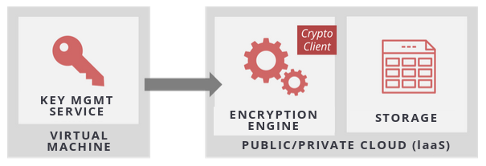
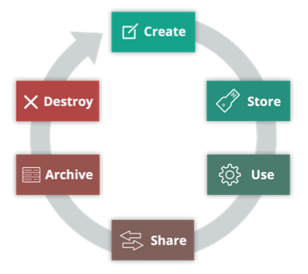

# Data Security for Cloud

1. [Cloud Data Storage & Data Moving to the Cloud](#cloud-data-storage--data-moving-to-the-cloud)
2. [Securing Data in the Cloud](#securing-data-in-the-cloud)
3. [Encryption for IaaS](#encryption-for-iaas)
4. [Encryption for Paas & SaaS](#encryption-for-paas--saas)
5. [Encryption Key Management](#encryption-key-management)
6. [Other Data Security Options](#other-data-security-options)
7. [Data Security Lifecycle](#data-security-lifecycle)

## Cloud Data Storage & Data Moving to the Cloud

* Cloud data storage is based on abstraction/virtualization and does not use off-the-shelf tech.

* Major cloud data storage types:

  * Volume - virtual hard drive for VM

  * Object - resilient file storage via API

  * Database - relational, non-relational

  * Application/Platform - CDN, SaaS for file storage, etc.

* Management of data migrating to the cloud can include components such as DAM (Database Access Monitoring), CASB (Cloud Access Security Brokers), DLP (Data Loss Prevention) and URL (Uniform Resource Locator Filtering).

* CASB, or Cloud Security Gateways, has three key functions - Discover, Monitor and Protect.

## Securing Data in the Cloud

* Access controls are the most foundational security controls; includes management plane, public & internal sharing controls, and app-level controls.

* Granularity of access controls varies between platforms and services.

* An entitlement matrix is the documentation of authorizations.

## Encryption for IaaS

* Cloud data encryption layers:

  * Application

  * Database

  * File/API

  * Volume storage

* Any cloud encryption system has the following components - data, encryption engine and the keys.

* Volume Storage Encryption:

* For object storage encryption, we can encrypt data on client side, server side or through storage proxies.

## Encryption for Paas & SaaS

* Encrypting PaaS can have 3 major options:

  * Application - Encrypt within app code; encrypt before sending to platform

  * Database - Transparent Database Encryption (TDE)

  * Other - Integrated into provider platform; customer-managed key options

* For PaaS encryption, volatile memory and swap files may be issues.

* SaaS encryption has two types:

  * Provider-managed - may offer customer-managed keys; commonly used.

  * Customer-managed - proxy encryption requires external tool/service; complex.

## Encryption Key Management

* Cloud key management techniques:

  * HSM/Appliance

  * Virtual appliance/software (dedicated tenancy)

  * Hybrid

  * Cloud provider service

* Providers encrypt customer data in their organizations, it's built into their platform; customers can also manage keys using BYOK (Bring Your Own Key).

* Cloud key management options:

  * Provider-managed - cloud provider manages encryption; customer owns keys, but provider manages.

  * 3rd party/customer managed - we own the keys, provider may manage; encryption management and data storage handled by cloud provider; good for SaaS and PaaS.

  * Customer key manager - virtual appliance option; we manage keys and encryption; good for IaaS.

  * HSM - used in hybrid cloud scenarios; very secure.

## Other Data Security Options

* Good architectural decisions can optimize security.

* Data Security controls:

  * Auditing, Monitoring & Alerting

  * Provider-specific controls

  * Data Loss Prevention (DLP)

  * Enterprise Rights Management/Digital Rights Management (ERM/DRM)

* Data masking is crucial for test data generation and to ensure production data is not exposed in dev environments.

## Data Security Lifecycle

* Data Security Lifecycle is a tool to help model the security controls.

* Data Security Lifecycle:

* The lifecycle does not address location or how data is accessed, so we have multiple data security lifecycles.

* Mapping elements across data security lifecycle is done using actors, functions and locations, mapped against potential and allowed actions using security controls.

* An entitlement matrix can be created for determining access controls.
