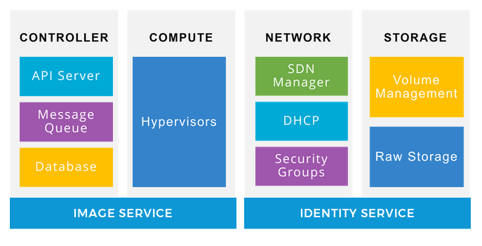
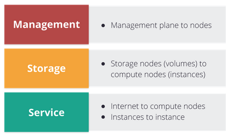
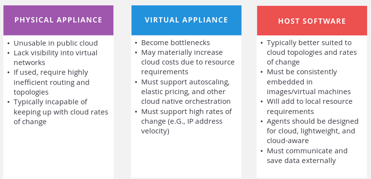
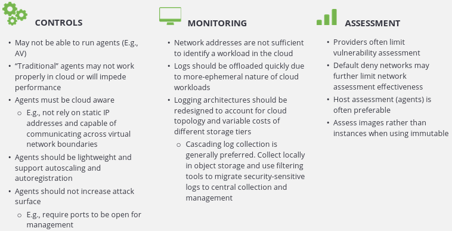
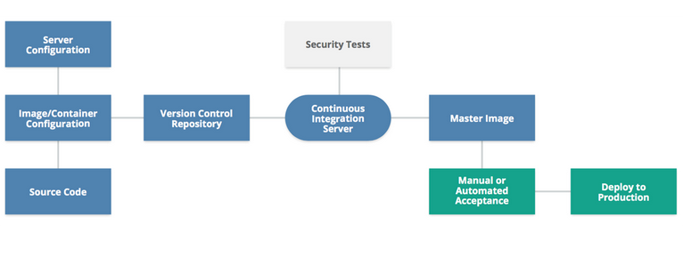

# Infrastructure Security for Cloud

1. [Introduction to Infrastructure Security for Cloud Computing](#introduction-to-infrastructure-security-for-cloud-computing)
2. [Software Defined Network](#software-defined-network)
3. [Cloud Network Security](#cloud-network-security)
4. [Securing Compute Workloads](#securing-compute-workloads)
5. [Management Plane Security](#management-plane-security)
6. [Business Continuity & Disaster Recovery](#business-continuity--disaster-recovery)

## Introduction to Infrastructure Security for Cloud Computing

* Macro layers (bottom to top) - Base Infra, Virtualized Infra, and Management Plane.

* Cloud security broadly covers components such as infra, hypervisors, network and management plane. Its advantages include:

  * Reduced capital expenditure
  * Better agility, resiliency
  * Better economic and security benefits

* Simplified Infrastructure Components:

* Securing cloud infrastructure:

  * Harden hosts
  * Harden infra services
  * Secure networks
  * Secure architecture
  * Harden management plane

## Software Defined Network

* Underlying Iaas Networks:

* While building underlying networks for cloud, it is recommended to:

  * Use separate physical networks (not VLANs).
  * Isolate the cloud networks from the LAN.

* Virtual networks:

  * Have same security concerns of a physical network (as it runs on top of one).
  * May provide a simpler stack to build private cloud.
  * Can include inherent security capabilities.

* Types of virtual networks:

  1. VLAN:

     * Leverage existing technology
     * Made for network segregation
     * Not effective in security
     * Limitations in cloud

  2. SDN:

     * Decouple network control plane from underlying hardware
     * Does not have limitations like traditional LAN
     * Flexibility, multiple implementations (API-enabled)
     * Rely on packet encapsulation
     * Effective in security

* SDN security benefits:

  * Easier isolation
  * Topology not limited to physical structure
  * SDN firewalls & security groups
  * Policies & controls

* SDN firewalls & security groups:

  * Policy-based
  * No additional hardware/software
  * Default-Deny usually
  * Apply on per-asset level (managed outside the asset)
  * Integrated into core SDN logic

## Cloud Network Security

* We can control the blast radius with virtual networks & cloud accounts using isolation.

* Losing network visibility is a common issue in virtual networks.

* Third-party security tools - pros & cons:

* Bastion virtual network - hybrid cloud network connecting isolated networks (cloud) and dedicated networks (data center).

* Provider & Consumer responsibilities:

  1. Provider:

     * Security of virtualization technology and management infra
     * Exposing security controls
     * Disabling attack surface

  2. Consumer:

     * Proper virtual network design
     * Implementing virtual security controls
     * Securing metastructure

## Securing Compute Workloads

* For securing workloads like virtual machines, stored procedures, code execution:

  * Configure environment securely
  * Implement application security fundamentals
  * Implement monitoring/logging

* Impact on traditional workload security controls:

* Compute workloads:

  * Standard/Long running - managed like traditional servers, less secure
  * Automated configuration management - VM configured using template/policy-based tool; manual changes disabled; moderately secure
  * Immutable - based on images and automatically deployed; login disabled to prevent changes; can be hardened for better security.

* Creating immutable images with deployment pipelines:

* Provider & Consumer responsibilities:

  1. Provider:

     * Workload isolation
     * Underlying infra security
     * Securing virtualization tech
     * Providing users security controls
     * Protecting volatile memory

  2. Consumer:

     * Security settings and controls
     * Monitoring, logging
     * Image asset management
     * Dedicated hosting if required

* Compute security recommendations:

  * Leverage immutable workloads if possible.
  * Maintain security controls for standard workloads using cloud-aware tools.
  * Store logs outside workloads.
  * Comply with cloud provider limitations on assessments and pentesting.

## Management Plane Security

## Business Continuity & Disaster Recovery
