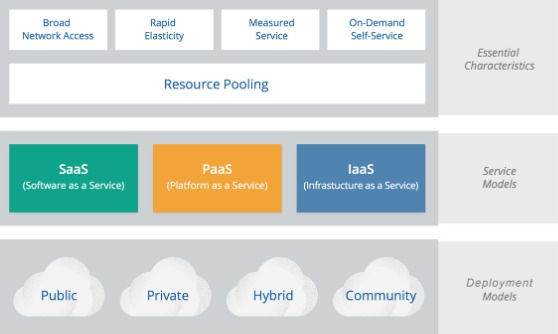
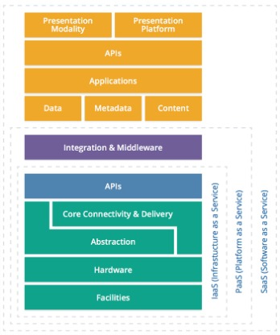
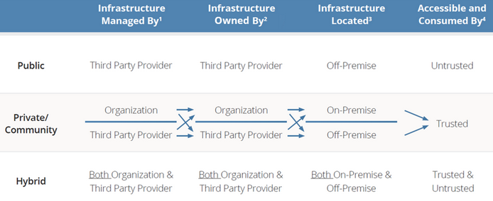
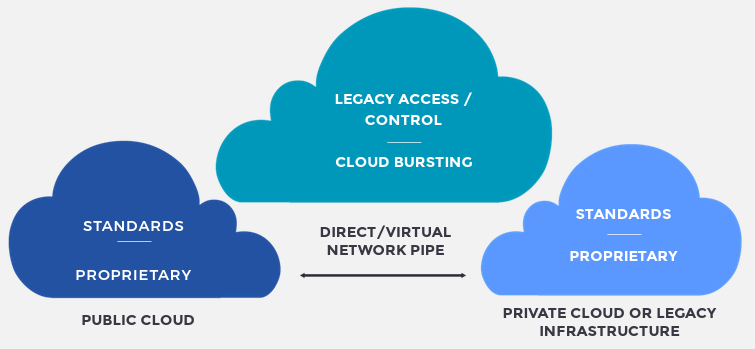
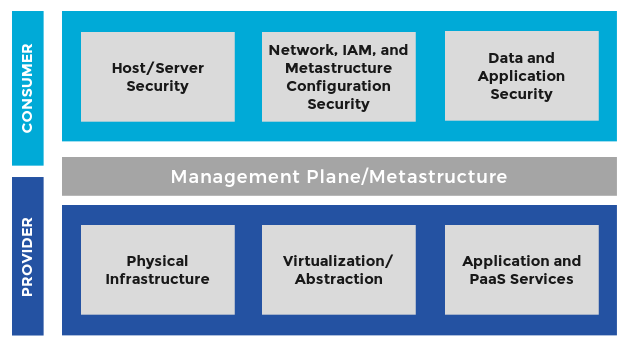
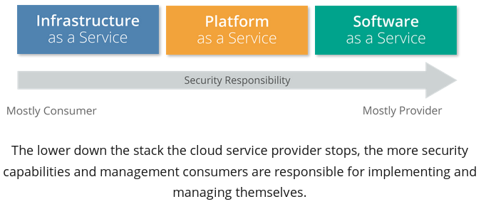

# Introduction to Cloud

1. [Introduction & Cloud Architecture](#introduction--cloud-architecture)
2. [Cloud Essential Characteristics](#cloud-essential-characteristics)
3. [Cloud Service Models](#cloud-service-models)
4. [Cloud Deployment Models](#cloud-deployment-models)
5. [Shared Responsibilities](#shared-responsibilities)

## Introduction & Cloud Architecture

* Resource pools are collections of physical resources such as Network, Compute and Storage. Building these involves two techniques:

    1. Abstraction (Virtualization) - Hypervisors, software-defined networking, storage abstraction.
    2. Automation (Orchestration) - Provision, Deprovision, Resize.

* Traditional virtualization - manual abstraction of resource pools; not elastic, and no self-service.

* Cloud computing - on-demand, dynamic, collection of resources and services, abstracted and automated; user-friendly.

* Benefits of cloud computing - Agility, Resiliency, Economics.

## Cloud Essential Characteristics

* NIST Model of Cloud Computing:

* Essential characteristics - Broad network access, rapid elasticity, measured service, on-demand self-service, resource pooling.

* Multitenancy - allowing multiple consumers to use a shared resource pool. Its features are:

  * Policy-driven enforcement
  * Segmentation
  * Isolation
  * Governance
  * Service levels
  * Chargeback/Billing models

## Cloud Service Models

* SPI stack model:

* Infrastructure as a Service (IaaS) - provisions basic computing resources; consumer deploys, runs any software.

* Platform as a Service (Paas) - app dev frameworks, middleware and functions (databases, message queues, etc.); deploy consumer-created apps onto cloud infra, created using languages and tools supported by cloud provider.

* Software as a Service (Saas) - consumer uses the provider's apps; not necessarily based on Iaas or Paas; user does not manage underlying cloud infra.

## Cloud Deployment Models

* Types of deployment models:

  * Public Cloud - cloud infra available publicly
  * Private Cloud - operated for a single organisation only
  * Community Cloud - operated by and for a specialized community
  * Hybrid Cloud - cloud infra is composition of multiple deployment models

* Hybrid Cloud:

* Logical Model:

  * Infrastructure - core computing components
  * Metastructure (Management plane) - protocols interfacing between infra and other layers
  * Applistructure - structure and services used for apps
  * Infostructure - info, content, databases, etc.

## Shared Responsibilities

* Shared Responsibilities Model:

* Security impact of service model:

* Cloud Security considerations:

  * Identify requirements
  * Provider, service and deployment models
  * Architecture
  * Assess and design security controls, control gaps
  * Manage changes
