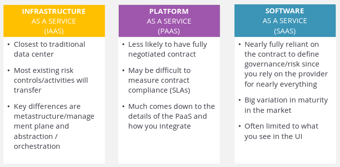
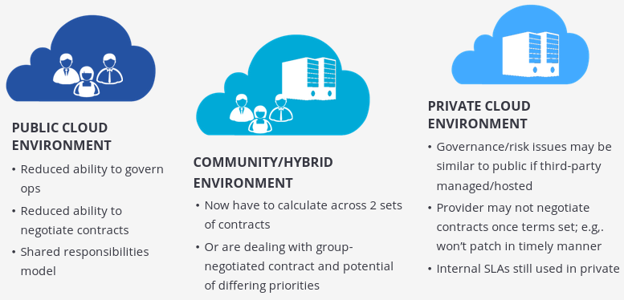
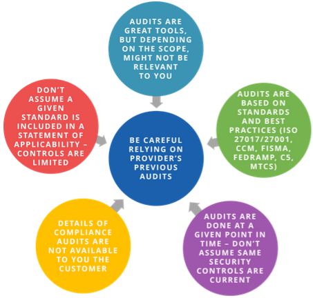

# Managing Cloud Security & Risk

1. [Governance](#governance)
2. [Managing Cloud Security Risk](#managing-cloud-security-risk)
3. [Compliance](#compliance)
4. [Legal Considerations for Cloud](#legal-considerations-for-cloud)
5. [Audit](#audit)
6. [CSA Tools](#csa-tools)

## Governance

* Simplified hierarchy - governance -> enterprise risk management -> information risk management -> information security.

* Tools of cloud governance - contracts (relation between provider and customer defined), supplier assessments, compliance reporting.

* From governance to risk - governance -> risk tolerance -> supplier assessment -> contracts -> shared responsibilities model -> risk management.

## Managing Cloud Security Risk

* Types of Risk management:

  * Enterprise risk management - providing value to stakeholders; measure, manage and mitigate uncertainty.

  * Information risk management - aligning risk management to tolerance of data owner; subset of enterprise risk management; primary means of decision support on CIA of assets.

* Service model effects:

* Deployment model effects:

* Tradeoff considerations:

  * Lesser physical control over assets and lower need to manage risks the provider accepts.

  * More reliance on SLA, contracts and assessments (instead of testing); higher requirement to manage relationship and stay updated.

* Cloud risk management tools:

  * Request documentation
  * Review security program
  * Review legal, regulatory, industrial, contract obligations
  * Evaluate service based on context of info assets involved
  * Evaluate provider

* Governance and Risk recommendations:

  * Identify shared responsibilites of security and risk management based on chosen service and deployment model.

  * Deploy cloud governance framework as per industry best practices and standards.

  * Understand how contract impacts the governance framework.

  * Develop process for cloud provider assessments.

  * Cloud provider re-assessments should occur on an automated and scheduled basis.

  * Cloud provider should offer easy access to documentation, reports.

  * Align risk requirements to assets involved and their risk tolerance.

  * Create risk management and risk mitigation methodology to assess every risk in space.

  * Use controls to manage residual risks.

  * Use tooling to track approved providers based on asset type, cloud usage, management.

## Compliance

* Sources of obligations include legislation, contracts, regulations (broad-based or industry-specific).

* Compliance validates awareness of corporate obligations and adhering to it; audits are key tools of proving compliance.

* Cloud changes compliance:

  * Cloud customer is responsible for compliance and has to rely on provider as well.
  
  * Cloud customers rely more on third-party assessments.

  * The cloud metastructure may span jurisdictions, while the assets don't, so this must be integrated into compliance activities.

  * Not all cloud providers and services are within same audit/certification scope.

* Compliance inheritance - if a provider's service is compliant with a standard, then consumers can build compliant services using that service; however, this does not guarantee compliance.

* Compliance, audit and assurance should be continuous.

## Legal Considerations for Cloud

* APAC:
  
  * Australia - Privacy Act of 1988, Australian Consumer Law (ACL)
  
  * China - 2017 Cyber Security Law

  * Japan - Act on the Protection of Personal Information (APPI)

  * Russia - Data protection laws

* EMEA:

  * European Union & European Economic Area - 2018 General Data Protection Regulation (GDPR), 2022 Directive on Privacy and Electronic Communications, Network Information Security Directive (NIS Directive).

  * Countries outside EU/EEA - 1995 EU Data Protection Directive

* Americas:

  * Central & South - European directive 95/46/EC, APEC Privacy Framework

  * Canada - Personal Information Protection and Electronic Documents Act (PIPEDA)

  * US - no single national law for data protection & regulation

  * US federal laws - Children's Online Privacy Protection Act of 1998 (COPPA), Accountability Act of 1996 (HIPAA)

* Industry standards - created by private organisations, so these are not laws.

* Contract terms - pricing, allocation of risk/responsibility, termination, representation & warranties, data ownership and location, SLA, PLA (privacy level agreement).

## Audit

* Audits/Assements/Attestations can vary across providers with different focuses.

* Attestations are legal statements; providers may be required by the auditor to have an NDA with customer before releasing.

* Cloud providers should have a rigorous portfolio of compliance attestations to support customers.

* Previous Audit results:

* Artifacts of compliance:

  * Policy & procedure documentation

  * Audit logs

  * Activity reporting

  * System config details

* In cloud, assessing risk (collecting audit evidence) can be challenging; understand requirements for logging and what data to collect.

* Due to evolving nature of cloud, frequent assessment is required.

## CSA Tools

* CCM (Cloud Controls Matrix):
  
  * A controls framework for organizations to operate securely when cloud services are utilized.

  * Intended for cloud providers, SaaS providers, end-user services; designed by SMEs.

  * Provides security principles to providers for best practices and assists customers to assess providers; standardized guidance.

  * Addresses intra- and inter-org challenges by delineating control ownership.

  * Aids in internal and external assessments and audits.

* CAIQ (Consensus Assessments Initiative Questionnaire):

  * Assesses the security postures of a cloud service provider.

  * To standardize approach of validation of cloud provider's security.

  * Streamlines compliance assessments and improves communication.

* STAR (Security, Trust & Assurance Registry):

  * Promotes security governance, assurance and compliance in cloud.

  * Third-party resources that encompass transparency, auditing and standards harmonization.

  * Offers self-assessment, third-party certification and attestation, and continuous auditing.

  * Customers can access security documentation for cloud providers from a single trusted repo.

* STARWatch:

  * SaaS application to help cloud providers manage compliance with CSA STAR requirements.

  * Helps in adoption and implementation of CCM and CAIQ; streamlines compliance efforts.

  * Allows users to create, edit, import and export CAIQs.

  * Incorporates a maturity model to measure evolution of security posture of organization.
